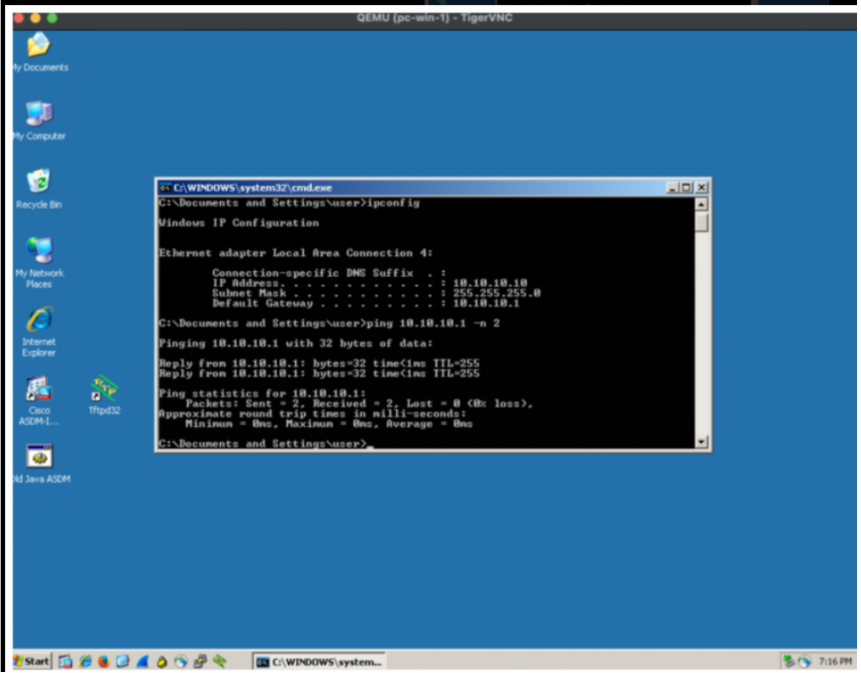
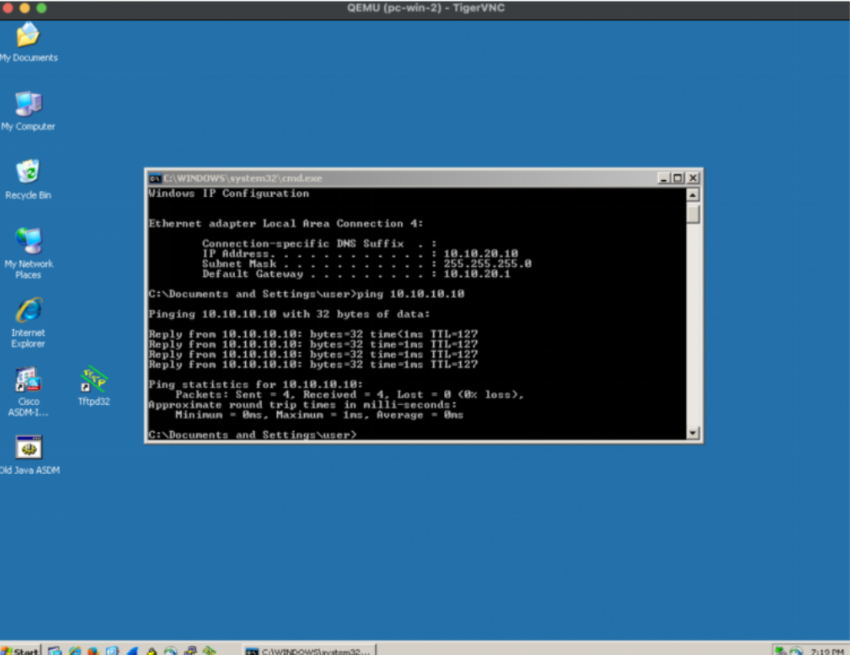
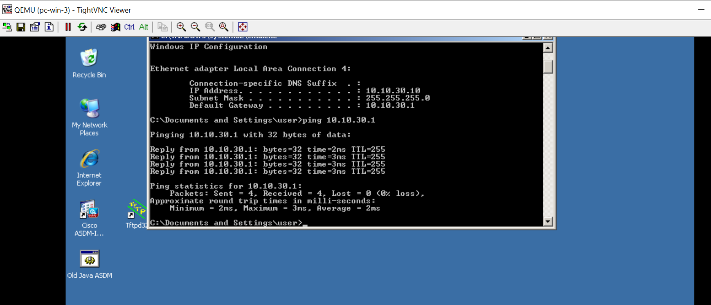
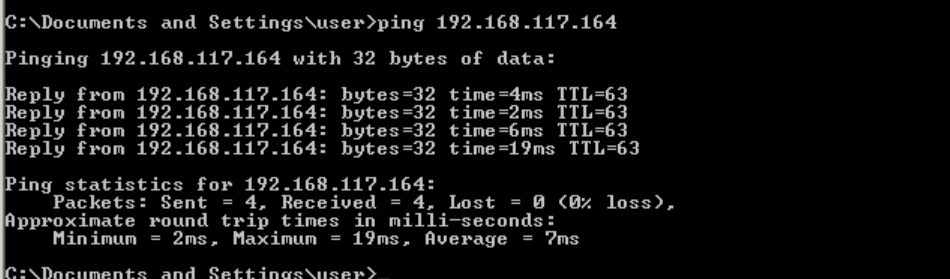
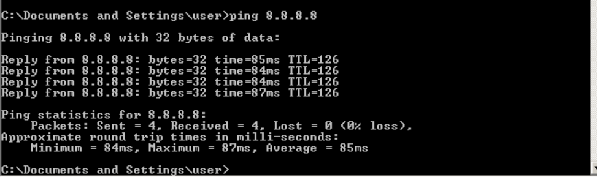
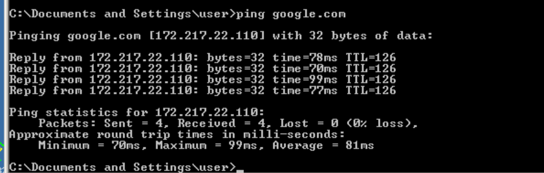

# Document de la Maquette Réseau – PPP Starlink Éducation

## 1. Objectifs de la maquette

Conformément au cahier des charges du projet, la maquette réseau poursuit les objectifs suivants :

### 1.1. Objectif général

Concevoir, dimensionner et documenter une maquette réseau fonctionnelle et reproductible pour une école rurale sénégalaise connectée via Starlink, dans le cadre du pilote défini par le projet.

### 1.2. Objectifs spécifiques

| N° | Objectif | Livrable associé |
|---|---|---|
| 1 | Concevoir une architecture réseau hiérarchique intégrant routeur Starlink, pare-feu pfSense, routeur R1, switch S1, contrôleur WiFi vWLC et serveur de supervision | Maquette GNS3 + schéma commenté |
| 2 | Mettre en œuvre la segmentation VLAN pour isoler les flux des élèves, enseignants, invités, administration et serveurs | Configuration du switch S1 |
| 3 | Configurer le routage inter-VLAN selon la technique "Router-on-a-stick" | Configuration du routeur R1 |
| 4 | Déployer un pare-feu pfSense pour la sécurité, le NAT, la QoS et le filtrage | Configuration pfSense |
| 5 | Mettre en place un contrôleur WiFi pour les SSIDs éducatifs et administratifs | Configuration vWLC |
| 6 | Configurer le service DHCP pour l'attribution automatique des adresses IP | Configuration R1 |
| 7 | Déployer une solution de supervision (Zabbix + Grafana) | Supervision SNMP |
| 8 | Valider l'ensemble par des tests de connectivité exhaustifs | Rapport de tests |

### 1.3. Contraintes du cahier des charges

| Contrainte | Description |
|---|---|
| Environnement | 100 % local et gratuit |
| Outil de simulation | GNS3 |
| Données réelles | Tarifs Starlink Sénégal, ARTP, UNESCO/UIT |
| Aucun terminal physique | Le pilote est conçu et chiffré |

---

## 2. Architecture réseau

### 2.1. Schéma synoptique

L'architecture globale de la maquette réseau déployée dans GNS3 est représentée par le schéma ci-dessous.

**Légende du schéma :**

| Élément | Description |
|---|---|
| Routeur-Starlink | Connexion WAN vers Internet (192.168.117.0/24) |
| pfSense | Pare-feu, NAT, QoS (WAN: 192.168.117.164/24, LAN: 10.0.0.1/30) |
| Routeur R1 | Routage inter-VLAN (Router-on-a-stick) |
| Switch-manage | Commutation et segmentation VLAN (Trunk 802.1Q) |
| Serveur Zabbix/Grafana | Supervision de l'infrastructure |
| Contrôleur WiFi | Gestion des SSIDs éducatifs et administratifs |
| pc-win-1 | Poste client du VLAN 10 (Management) |
| pc-win-2 | Poste client du VLAN 20 (Éducation) |
| pc-win-3 | Poste client du VLAN 30 (Administration) |

### 2.2. Plan d'adressage et VLANs

| VLAN | Nom | Sous-réseau | Passerelle | Usage |
|---|---|---|---|---|
| 10 | Management | 10.10.10.0/24 | 10.10.10.1 | Administration réseau |
| 20 | Éducation | 10.10.20.0/24 | 10.10.20.1 | Élèves et salles de classe |
| 30 | Administration | 10.10.30.0/24 | 10.10.30.1 | Enseignants et personnel |
| 40 | Invités | 10.10.40.0/24 | 10.10.40.1 | Visiteurs et événements |
| 50 | Serveurs | 10.10.50.0/24 | 10.10.50.1 | LMS, OER, supervision |

### 2.3. Principes de conception

L'architecture adoptée suit une approche hiérarchique en couches :

- **Couche WAN** : Routeur Starlink pour la connexion Internet
- **Couche sécurité** : pfSense pour le pare-feu, le NAT et la QoS
- **Couche distribution** : Routeur R1 pour le routage inter-VLAN
- **Couche accès** : Switch S1 et contrôleur vWLC
- **Couche supervision** : Serveur Zabbix/Grafana

---

## 3. Définitions des termes techniques

**Starlink** : Service de connexion Internet par satellite développé par SpaceX. Il utilise une constellation de satellites en orbite basse (LEO) pour fournir un accès haut débit et faible latence dans les zones rurales et isolées.

**VLAN (Virtual Local Area Network)** : Réseau local virtuel permettant de segmenter logiquement un réseau physique en plusieurs réseaux distincts.

**Trunk (802.1Q)** : Liaison physique capable de transporter le trafic de plusieurs VLANs simultanément. Le protocole 802.1Q ajoute un tag VLAN à chaque trame.

**Router-on-a-stick** : Technique permettant à un routeur d'assurer le routage entre plusieurs VLANs en utilisant une seule interface physique subdivisée en sous-interfaces.

**Sous-interface** : Interface logique créée sur une interface physique, associée à un VLAN spécifique et possédant sa propre adresse IP.

**VLAN natif** : VLAN dont le trafic n'est pas tagué sur un trunk. Le VLAN 10 (Management) est utilisé comme VLAN natif.

**DHCP (Dynamic Host Configuration Protocol)** : Protocole permettant l'attribution automatique d'adresses IP aux équipements d'un réseau.

**Pool DHCP** : Ensemble d'adresses IP qu'un serveur DHCP peut attribuer aux clients.

**Bail DHCP** : Durée pendant laquelle une adresse IP est attribuée à un client.

**NAT (Network Address Translation)** : Technique permettant de traduire les adresses IP privées en adresses publiques.

**Pare-feu (Firewall)** : Équipement ou logiciel filtrant le trafic réseau selon des règles définies.

**QoS (Quality of Service)** : Mécanisme permettant de prioriser certains types de trafic.

**SNMP (Simple Network Management Protocol)** : Protocole standard permettant la supervision des équipements réseau.

**Communauté SNMP** : Mot de passe permettant l'accès aux informations SNMP d'un équipement.

**SSID (Service Set Identifier)** : Nom du réseau WiFi diffusé par un point d'accès.

**WPA2-PSK** : Protocole de sécurité WiFi utilisant une clé pré-partagée pour l'authentification.

**WLC (Wireless LAN Controller)** : Contrôleur gérant centralement les points d'accès WiFi.

**vWLC** : Version virtualisée du contrôleur WiFi Cisco.

**Zabbix** : Solution open source de supervision réseau.

**Grafana** : Plateforme de visualisation de données et de tableaux de bord.

**GNS3** : Simulateur réseau permettant de reproduire des topologies complexes.

**pfSense** : Distribution FreeBSD spécialisée dans les fonctions de pare-feu et de routage.

**LEO (Low Earth Orbit)** : Orbite basse terrestre, utilisée par les satellites Starlink.

**ARTP** : Autorité de Régulation des Télécommunications et des Postes du Sénégal.

**New Deal Technologique** : Programme gouvernemental sénégalais visant à connecter un million de citoyens d'ici fin 2026.

**GIGA** : Initiative conjointe de l'UNICEF et de l'UIT pour connecter toutes les écoles du monde à Internet.

**LMS (Learning Management System)** : Plateforme de gestion de l'apprentissage en ligne (Moodle, Canvas).

**OER (Open Educational Resources)** : Ressources éducatives libres et gratuites, accessibles en ligne.

---

## 4. Description des équipements

### 4.1. Routeur Starlink

**Modèle / Type** : Kit Standard Starlink

**Rôle Principal** : Connexion WAN vers Internet

**Interfaces Clés** : DHCP sur 192.168.117.0/24

**Qu'est-ce que Starlink ?**

Starlink est un service de connexion Internet par satellite développé par SpaceX. Il utilise une constellation de satellites en orbite basse (LEO) pour fournir un accès haut débit et faible latence. Contrairement aux satellites géostationnaires traditionnels (VSAT), les satellites Starlink sont situés à environ 550 km d'altitude, ce qui réduit considérablement la latence (20 à 40 ms contre 600 ms pour le VSAT).

**But de Starlink dans cette maquette**

Dans le cadre de ce projet, Starlink a pour but de connecter une école rurale sénégalaise à Internet là où les infrastructures terrestres (fibre optique, 4G) sont absentes ou insuffisantes. Il permet :

- L'accès aux plateformes pédagogiques en ligne (Moodle, Canvas)
- La visioconférence pour les cours à distance
- L'accès aux ressources éducatives libres (OER)
- La formation des enseignants à distance
- La supervision de l'infrastructure réseau

**Fonctions assurées**

- **Connectivité satellitaire** : Établissement et maintien de la liaison avec les satellites Starlink.
- **Attribution d'adresses IP** : Distribution d'adresses IP dynamiques via DHCP sur le réseau local 192.168.117.0/24.
- **Accès Internet** : Fourniture d'un accès haut débit avec des débits pouvant atteindre 305 Mbps en réception et 20 à 40 Mbps en émission.

**Interconnexion** : Le routeur Starlink est connecté à l'interface WAN de pfSense (192.168.117.164/24).

---

### 4.2. pfSense

**Modèle / Type** : pfSense 2.7.2-RELEASE

**Rôle Principal** : Pare-feu, NAT, QoS, Filtrage de contenu

**Interfaces Clés** : WAN sur 192.168.117.64/24 et LAN sur 10.0.0.1/30

pfSense constitue le cœur de la sécurité et de la gestion du réseau. Il s'agit d'une distribution FreeBSD spécialisée dans les fonctions de pare-feu et de routage. Il occupe une position centrale entre le routeur Starlink et le routeur R1.

**Fonctions assurées**

- **Pare-feu** : Analyse de chaque paquet réseau et décision d'autorisation ou de blocage selon des règles définies.
- **NAT** : Traduction des adresses IP privées des VLANs (10.10.0.0/16) en l'adresse publique du routeur Starlink.
- **QoS** : Priorisation du trafic pédagogique (visioconférence, LMS) sur le trafic récréatif.
- **Filtrage de contenu** : Blocage des sites non éducatifs via Squid Proxy et pfBlockerNG.
- **SNMP** : Exposition des métriques pour la supervision par Zabbix.

**Interconnexion** : L'interface WAN (em0) est connectée au routeur Starlink. L'interface LAN (em1) est connectée au routeur R1.

---

### 4.3. Routeur R1

**Modèle / Type** : Cisco 4321

**Rôle Principal** : Routage inter-VLAN (Router-on-a-stick) et serveur DHCP

**Interfaces Clés** : Sous-interfaces pour les VLANs 10, 20, 30, 40, 50 et interface e0/1 sur 10.0.0.2/30

Le routeur R1 assure le routage entre les différents VLANs et intègre le service DHCP pour l'attribution automatique des adresses IP.

**Fonctions assurées**

- **Routage inter-VLAN** : Acheminement du trafic entre les différents segments logiques du réseau.
- **Service DHCP** : Attribution automatique des adresses IP aux clients de chaque VLAN via des pools dédiés.
- **Router-on-a-stick** : Utilisation d'une seule interface physique subdivisée en sous-interfaces pour transporter le trafic de tous les VLANs.
- **Passerelle par défaut** : Chaque sous-interface sert de passerelle pour son VLAN respectif.

**Interconnexion** : R1 est connecté au switch S1 via l'interface e0/0 en mode trunk. R1 est connecté à pfSense via l'interface e0/1 (10.0.0.2/30).

---

### 4.4. Switch S1

**Modèle / Type** : Cisco 2960

**Rôle Principal** : Commutation et segmentation VLAN

**Interfaces Clés** : Trunk vers R1 sur e0/0, trunk vers vWLC sur e0/2, ports d'accès pour les clients

Le switch S1 constitue la couche d'accès et de distribution du réseau. Il assure la connectivité physique des clients et la segmentation logique via les VLANs.

**Fonctions assurées**

- **Commutation Ethernet** : Acheminement des trames entre les ports au niveau de la couche 2.
- **Segmentation VLAN** : Isolation logique du réseau en segments virtuels correspondant aux profils d'utilisateurs.
- **Ports d'accès** : Configuration des ports connectés aux utilisateurs finaux (un VLAN par port).
- **Ports trunk** : Configuration des ports connectés aux équipements d'infrastructure (transport de plusieurs VLANs).

**Interconnexion** : Le switch S1 est connecté au routeur R1 (trunk e0/0), au contrôleur vWLC (trunk e0/2) et aux clients (ports d'accès).

---

### 4.5. Contrôleur WiFi (vWLC)

**Modèle / Type** : Cisco 2504 (version virtualisée)

**Rôle Principal** : Contrôleur WiFi

**Interfaces Clés** : Interfaces dynamiques pour les VLANs 20 et 30, SSIDs éducatifs et administratifs

Le vWLC gère les points d'accès sans fil et les connexions des utilisateurs mobiles.

**Fonctions assurées**

- **Gestion des points d'accès** : Configuration, supervision et mise à jour des APs.
- **Gestion des SSIDs** : Création et gestion des réseaux WiFi (Starlink-Education et Starlink-Admin).
- **Authentification et sécurité** : Authentification des utilisateurs via WPA2-PSK.
- **Itinérance (Roaming)** : Transition transparente entre les points d'accès.

**Interconnexion** : Le vWLC est connecté au switch S1 via le port e0/2 en mode trunk.

---

### 4.6. Serveur Zabbix

**Modèle / Type** : Ubuntu 24.04 LTS

**Rôle Principal** : Supervision et collecte de métriques réseau

**Interfaces Clés** : SNMP vers les équipements supervisés, interface web pour l'administration

Zabbix collecte en continu des métriques sur l'état et la performance des équipements réseau.

**Fonctions assurées**

- **Collecte de métriques** : Interrogation régulière des équipements via SNMP.
- **Stockage historique** : Conservation des données dans une base MySQL.
- **Détection d'anomalies** : Comparaison des métriques avec des seuils et déclenchement d'alertes.
- **Visualisation** : Interface web pour consulter l'état des équipements.

**Interconnexion** : Le serveur Zabbix est connecté au switch S1 sur le VLAN 50 avec l'adresse 10.10.50.100/24.

---

### 4.7. Grafana

**Modèle / Type** : Ubuntu 24.04 LTS

**Rôle Principal** : Visualisation et tableaux de bord

**Interfaces Clés** : Connexion à la base de données Zabbix, interface web

Grafana permet de créer des tableaux de bord personnalisés à partir des données collectées par Zabbix.

**Fonctions assurées**

- **Visualisation avancée** : Graphiques (jauges, courbes, barres) pour représenter les métriques.
- **Tableaux de bord personnalisés** : Vues adaptées aux différents publics.
- **Alertes visuelles** : Indicateurs d'alerte directement sur les tableaux de bord.
- **Partage** : Diffusion des tableaux de bord avec des droits différenciés.

**Interconnexion** : Grafana est installé sur le même serveur que Zabbix ou sur un serveur dédié.

---

### 4.8. Postes Clients

**Modèle / Type** : PC, ordinateurs portables et smartphones

**Rôle Principal** : Simulation des usagers de l'école

**Interfaces Clés** : Répartis sur les VLANs 10, 20, 30 et 40

Les postes clients représentent les utilisateurs finaux : élèves, enseignants, personnel administratif et invités.

**Types de clients**

- **Clients du VLAN 20 (Éducation)** : Élèves et postes dans les salles de classe.
- **Clients du VLAN 30 (Administration)** : Enseignants et personnel administratif.
- **Clients du VLAN 10 (Management)** : Administrateurs réseau.
- **Clients du VLAN 40 (Invités)** : Visiteurs et participants à des événements.

**Interconnexion** : Les postes clients sont connectés aux ports d'accès du switch S1 ou aux SSIDs du vWLC.

---

## 5. Plan d'adressage

### 5.1. VLANs et sous-réseaux

| VLAN | Nom | Sous-réseau | Passerelle | Plage DHCP | Usage |
|---|---|---|---|---|---|
| 10 | Management | 10.10.10.0/24 | 10.10.10.1 | 10.10.10.100-200 | Administration réseau |
| 20 | Éducation | 10.10.20.0/24 | 10.10.20.1 | 10.10.20.100-250 | Élèves et salles de classe |
| 30 | Administration | 10.10.30.0/24 | 10.10.30.1 | 10.10.30.100-200 | Enseignants et personnel |
| 40 | Invités | 10.10.40.0/24 | 10.10.40.1 | 10.10.40.100-150 | Visiteurs et événements |
| 50 | Serveurs | 10.10.50.0/24 | 10.10.50.1 | Statique | LMS, OER, supervision |

### 5.2. Adressage des équipements d'infrastructure

| Équipement | Interface | Adresse IP | VLAN |
|---|---|---|---|
| Routeur Starlink | WAN | 192.168.117.1/24 | - |
| pfSense | WAN (em0) | 192.168.117.164/24 | - |
| pfSense | LAN (em1) | 10.0.0.1/30 | - |
| Routeur R1 | e0/1 | 10.0.0.2/30 | - |
| Routeur R1 | e0/0.10 | 10.10.10.1/24 | 10 |
| Routeur R1 | e0/0.20 | 10.10.20.1/24 | 20 |
| Routeur R1 | e0/0.30 | 10.10.30.1/24 | 30 |
| Routeur R1 | e0/0.40 | 10.10.40.1/24 | 40 |
| Routeur R1 | e0/0.50 | 10.10.50.1/24 | 50 |
| Switch S1 | Management | 10.10.10.2/24 | 10 |
| vWLC | Management | 10.10.10.250/24 | 10 |
| vWLC | vlan20_edu | 10.10.20.250/24 | 20 |
| vWLC | vlan30_admin | 10.10.30.250/24 | 30 |
| Serveur Zabbix | Serveurs | 10.10.50.100/24 | 50 |

### 5.3. SSIDs WiFi

| SSID | VLAN | Interface | Sécurité | Usage |
|---|---|---|---|---|
| Starlink-Education | 20 | vlan20_edu | WPA2-PSK | Élèves |
| Starlink-Admin | 30 | vlan30_admin | WPA2-PSK | Enseignants |

---

## 6. Mise en œuvre

### 6.1. Prérequis

**Logiciels requis**

- GNS3 2.2 ou supérieur
- GNS3 VM (recommandé pour les performances)
- Images Cisco : IOS pour routeur 4321 et switch 2960
- pfSense : image ISO ou VM (version 2.7.2 ou supérieure)
- vWLC : image Cisco WLC (version 8.10 ou supérieure)
- Ubuntu Server 24.04 LTS (pour le serveur Zabbix)

**Ressources système recommandées**

| Ressource | Minimum | Recommandé |
|---|---|---|
| RAM | 8 Go | 16 Go |
| CPU | 4 cœurs | 8 cœurs |
| Disque | 50 Go | 100 Go |

### 6.2. Installation

**1. Cloner le dépôt**

```bash
git clone https://github.com/paulepricna/ppp-starlink-education.git
cd ppp-starlink-education/maquette
```

**2. Ouvrir le projet dans GNS3**

1. Lancez GNS3
2. Cliquez sur **File > Open project**
3. Naviguez jusqu'au dossier `maquette/gns3_project/`
4. Sélectionnez le fichier `project.gns3`
5. Cliquez sur **Ouvrir**

**3. Démarrer les équipements**

1. Cliquez sur le bouton **Start all devices** (icône play verte)
2. Attendez que tous les voyants passent au vert

**4. Charger les configurations**

Pour chaque équipement, chargez la configuration depuis le dossier `configs/`.

---

### 6.3. Configuration du Switch S1

#### Étape 0 : Architecture et ports du switch S1

Avant de commencer la configuration, voici le schéma de la maquette réseau montrant les ports du switch S1 et leurs interconnexions.

**Sur ce schéma, on peut identifier les ports du switch S1 :**

| Port | Mode | VLAN(s) | Destination |
|---|---|---|---|
| e0/0 | Trunk | 10,20,30,40,50 | Routeur R1 |
| e0/1 | Access | 50 | Serveur Zabbix (Ubuntu 24.04) |
| e0/2 | Trunk | 10,20,30 | Contrôleur WiFi vWLC |
| e0/3 | Access | 10 | pc-win-1 (Management) |
| e1/0 | Access | 30 | pc-win-3 (Administration) |
| e1/1 | Access | 20 | pc-win-2 (Éducation) |

**Explication des connexions**

- **Trunk e0/0** : Liaison vers le routeur R1, transporte tous les VLANs (10, 20, 30, 40, 50)
- **Trunk e0/2** : Liaison vers le contrôleur vWLC, transporte les VLANs 10, 20 et 30
- **Ports d'accès** : Chaque port est assigné à un VLAN spécifique (un port = un VLAN)
- **VLAN natif** : Le VLAN 10 (Management) est utilisé comme VLAN natif sur les trunks

#### Étape 1 : Création des VLANs

La première étape consiste à créer les différents VLANs qui segmenteront le réseau de l'école.

**Commandes exécutées**

```cisco
S1(config)#vlan 10
S1(config-vlan)#name Management
S1(config-vlan)#vlan 20
S1(config-vlan)#name Education
S1(config-vlan)#vlan 30
S1(config-vlan)#name Administration
S1(config-vlan)#vlan 40
S1(config-vlan)#name Invites
S1(config-vlan)#vlan 50
S1(config-vlan)#name Serveurs
S1(config-vlan)#exit
```

**Explication**

- **VLAN 10 (Management)** : Dédié à l'administration réseau
- **VLAN 20 (Education)** : Dédié aux élèves et aux salles de classe
- **VLAN 30 (Administration)** : Dédié aux enseignants et au personnel
- **VLAN 40 (Invites)** : Dédié aux visiteurs et événements
- **VLAN 50 (Serveurs)** : Dédié aux serveurs (LMS, OER, supervision)

#### Étape 2 : Configuration des ports d'accès

Une fois les VLANs créés, il faut assigner les ports d'accès aux différents VLANs.

**Configuration du port d'accès pour le VLAN 50 (Serveurs)**

```cisco
S1(config)#interface ethernet 0/1
S1(config-if)#switchport mode access
S1(config-if)#switchport access vlan 50
S1(config-if)#exit
```

La commande `interface ethernet 0/1` sélectionne le port physique Ethernet 0/1 du switch S1. Ce port est destiné à être connecté au serveur Zabbix, qui doit appartenir au VLAN 50 (Serveurs).

La commande `switchport mode access` configure le port en mode accès. Un port en mode accès ne transporte le trafic que d'un seul VLAN.

La commande `switchport access vlan 50` assigne le port au VLAN 50 (Serveurs). Tout le trafic entrant et sortant sur ce port sera associé à ce VLAN.

**Configuration des ports d'accès pour les VLANs 10, 20 et 30**

```cisco
S1(config)#interface ethernet 0/3
S1(config-if)#switchport mode access
S1(config-if)#switchport access vlan 10
S1(config-if)#exit

S1(config)#interface ethernet 1/1
S1(config-if)#switchport mode access
S1(config-if)#switchport access vlan 20
S1(config-if)#exit

S1(config)#interface ethernet 1/0
S1(config-if)#switchport mode access
S1(config-if)#switchport access vlan 30
S1(config-if)#exit
```

**Configuration du port Ethernet 0/3 (VLAN 10 - Management)**

La commande `interface ethernet 0/3` sélectionne le port physique Ethernet 0/3 du switch S1. Ce port est destiné à être connecté au poste d'administration réseau `pc-win-1`.

La commande `switchport access vlan 10` assigne le port au VLAN 10 (Management).

**Configuration du port Ethernet 1/1 (VLAN 20 - Éducation)**

La commande `interface ethernet 1/1` sélectionne le port physique Ethernet 1/1. Ce port est destiné à être connecté au poste élève `pc-win-2`.

La commande `switchport access vlan 20` assigne le port au VLAN 20 (Éducation).

**Configuration du port Ethernet 1/0 (VLAN 30 - Administration)**

La commande `interface ethernet 1/0` sélectionne le port physique Ethernet 1/0. Ce port est destiné à être connecté au poste enseignant `pc-win-3`.

La commande `switchport access vlan 30` assigne le port au VLAN 30 (Administration).

#### Étape 3 : Configuration des trunks

**Configuration du trunk vers le contrôleur WiFi (vWLC)**

```cisco
S1(config)#interface e0/2
S1(config-if)#switchport trunk encapsulation dot1q
S1(config-if)#switchport mode trunk
S1(config-if)#desc Lien vers le vWLC
S1(config-if)#switchport trunk native vlan 10
S1(config-if)#switchport trunk allowed vlan 10,20,30,40,50
S1(config-if)#switchport nonegotiate
S1(config-if)#exit
```

La commande `interface e0/2` sélectionne le port physique Ethernet 0/2, dédié à la connexion avec le contrôleur WiFi vWLC.

La commande `switchport trunk encapsulation dot1q` spécifie le protocole d'encapsulation (802.1Q).

La commande `switchport mode trunk` configure le port en mode trunk pour transporter plusieurs VLANs.

La commande `desc Lien vers le vWLC` ajoute une description au port.

La commande `switchport trunk native vlan 10` définit le VLAN 10 (Management) comme VLAN natif.

La commande `switchport trunk allowed vlan 10,20,30,40,50` spécifie la liste des VLANs autorisés sur le trunk.

La commande `switchport nonegotiate` désactive la négociation automatique du mode trunk (DTP), renforçant la sécurité.

**Configuration du trunk vers le routeur R1**

```cisco
S1(config)#interface e0/0
S1(config-if)#switchport trunk encapsulation dot1q
S1(config-if)#switchport mode trunk
S1(config-if)#switchport trunk native vlan 10
S1(config-if)#switchport trunk allowed vlan 10,20,30,40,50
S1(config-if)#desc Lien vers R1
S1(config-if)#do wr
```

La commande `interface e0/0` sélectionne le port physique Ethernet 0/0, dédié à la liaison vers le routeur R1.

La commande `switchport trunk allowed vlan 10,20,30,40,50` spécifie la liste des VLANs autorisés sur le trunk.

La commande `do wr` sauvegarde la configuration en mémoire NVRAM.

#### Étape 4 : Vérification des VLANs et des trunks

**Vérification des VLANs**

```cisco
S1(config)#do show vlan brief
```

**Résultat obtenu**

```
VLAN Name                             Status    Ports
---- -------------------------------- --------- -------------------------------
1    default                          active    Et0/0, Et0/1, Et0/2, Et0/3
                                                Et1/0, Et1/1, Et1/2, Et1/3
                                                Et2/0, Et2/1, Et2/2, Et2/3
                                                Et3/0, Et3/1, Et3/2, Et3/3
10   Management                       active
20   Education                        active
30   Administration                   active
40   Invites                          active
50   Serveurs                         active
1002 fddi-default                     act/unsup
1003 token-ring-default               act/unsup
1004 fddinet-default                  act/unsup
1005 trnet-default                    act/unsup
```

**Commentaire du résultat**

La commande `show vlan brief` affiche la liste complète des VLANs configurés sur le switch S1. Les cinq VLANs (10, 20, 30, 40, 50) apparaissent avec le statut **active**, confirmant qu'ils sont correctement créés et opérationnels. Les VLANs 1002 à 1005 sont des VLANs par défaut spécifiques à Cisco et n'ont aucune incidence sur notre configuration.

**Vérification des trunks**

```cisco
S1(config)#do show interface trunk
```

**Résultat obtenu**

```
Port    Mode    Encapsulation  Status    Native vlan
Et0/0   on      802.1q         trunking  10
Et0/2   on      802.1q         trunking  10

Port    Vlans allowed on trunk
Et0/0   10,20,30,40,50
Et0/2   10,20,30,40,50

Port    Vlans allowed and active in management domain
Et0/0   10,20,30,40,50
Et0/2   10,20,30,40,50

Port    Vlans in spanning tree forwarding state and not pruned
Et0/0   10,20,30,40,50
Et0/2   10,20,30,40,50
```

**Commentaire du résultat**

La commande `show interface trunk` confirme que les deux ports trunk (Et0/0 et Et0/2) sont opérationnels avec le statut **trunking**. L'encapsulation 802.1Q est correctement configurée. Le VLAN natif est défini sur 10 (Management) pour les deux trunks. La liste des VLANs autorisés correspond à l'ensemble des VLANs configurés.

**Conclusion de la vérification**

- Les cinq VLANs sont **actifs** et correctement nommés
- Les ports d'accès sont assignés aux bons VLANs
- Les deux trunks sont **opérationnels** avec les VLANs autorisés
- Le VLAN natif est bien configuré sur 10 (Management)

La configuration du switch S1 est **validée** et prête pour les tests de connectivité.

---

### 6.4. Configuration du Routeur R1

#### Étape 1 : Configuration de base et des sous-interfaces VLAN

```cisco
R1(config)#hostname R1
R1(config)#interface e0/0
R1(config-if)#no shutdown
R1(config-if)#desc Lien vers le switch S1
R1(config-if)#exit

R1(config)#interface e0/0.10
R1(config-subif)#encapsulation dot1Q 10 native
R1(config-subif)#ip address 10.10.10.1 255.255.255.0
R1(config-subif)#exit

R1(config)#interface e0/0.20
R1(config-subif)#encapsulation dot1Q 20
R1(config-subif)#ip address 10.10.20.1 255.255.255.0
R1(config-subif)#exit

R1(config)#interface e0/0.30
R1(config-subif)#encapsulation dot1Q 30
R1(config-subif)#ip address 10.10.30.1 255.255.255.0
R1(config-subif)#exit

R1(config)#interface e0/0.40
R1(config-subif)#encapsulation dot1Q 40
R1(config-subif)#ip address 10.10.40.1 255.255.255.0
R1(config-subif)#exit

R1(config)#interface e0/0.50
R1(config-subif)#encapsulation dot1Q 50
R1(config-subif)#ip address 10.10.50.1 255.255.255.0
R1(config-subif)#exit
```

**Analyse détaillée**

La commande `hostname R1` modifie le nom d'hôte du routeur pour l'identifier clairement.

La commande `interface e0/0` sélectionne l'interface physique Ethernet 0/0, connectée au switch S1. La commande `no shutdown` active cette interface.

Les sous-interfaces sont créées selon le principe du **Router-on-a-stick**. La sous-interface `e0/0.10` est associée au VLAN 10 (Management) avec la commande `encapsulation dot1Q 10 native`. Le paramètre "native" indique que le VLAN 10 est le VLAN natif. Les sous-interfaces `e0/0.20` à `e0/0.50` sont associées respectivement aux VLANs 20, 30, 40 et 50.

Chaque sous-interface reçoit une adresse IP qui sert de passerelle par défaut pour son VLAN respectif.

#### Étape 2 : Configuration de l'interface vers pfSense

```cisco
R1(config)#interface e0/1
R1(config-if)#ip address 10.0.0.2 255.255.255.252
R1(config-if)#no shutdown
R1(config-if)#desc Lien vers pfSense
R1(config-if)#exit
```

L'interface Ethernet 0/1 est dédiée à la liaison avec pfSense. L'adresse IP `10.0.0.2/30` est attribuée avec un masque `/30`, créant un réseau point-à-point avec exactement deux adresses utilisables : `10.0.0.1` pour pfSense et `10.0.0.2` pour R1.

#### Étape 3 : Configuration de la route par défaut

```cisco
R1(config)#ip route 0.0.0.0 0.0.0.0 10.0.0.1
```

Cette commande configure la route par défaut sur le routeur R1. Tout le trafic dont la destination n'est pas connue localement sera envoyé à `10.0.0.1`, l'interface LAN de pfSense.

#### Étape 4 : Configuration du service DHCP

```cisco
R1(config)#ip dhcp excluded-address 10.10.10.1 10.10.10.99
R1(config)#ip dhcp excluded-address 10.10.20.1 10.10.20.99
R1(config)#ip dhcp excluded-address 10.10.30.1 10.10.30.99
R1(config)#ip dhcp excluded-address 10.10.40.1 10.10.40.99

R1(config)#ip dhcp pool MANAGEMENT
R1(dhcp-config)#network 10.10.10.0 255.255.255.0
R1(dhcp-config)#default-router 10.10.10.1
R1(dhcp-config)#dns-server 8.8.8.8
R1(dhcp-config)#lease 1
R1(dhcp-config)#exit

R1(config)#ip dhcp pool EDUCATION
R1(dhcp-config)#network 10.10.20.0 255.255.255.0
R1(dhcp-config)#default-router 10.10.20.1
R1(dhcp-config)#dns-server 8.8.8.8
R1(dhcp-config)#lease 1
R1(dhcp-config)#exit

R1(config)#ip dhcp pool ADMINISTRATION
R1(dhcp-config)#network 10.10.30.0 255.255.255.0
R1(dhcp-config)#default-router 10.10.30.1
R1(dhcp-config)#dns-server 8.8.8.8
R1(dhcp-config)#lease 1
R1(dhcp-config)#exit

R1(config)#ip dhcp pool INVITES
R1(dhcp-config)#network 10.10.40.0 255.255.255.0
R1(dhcp-config)#default-router 10.10.40.1
R1(dhcp-config)#dns-server 8.8.8.8
R1(dhcp-config)#lease 0 4
R1(dhcp-config)#exit
```

Les commandes `ip dhcp excluded-address` réservent les premières adresses de chaque sous-réseau pour les équipements d'infrastructure. Quatre pools DHCP sont configurés, un pour chaque VLAN. Le pool INVITES a une durée de bail plus courte (4 heures).

#### Étape 5 : Vérification des interfaces

```cisco
R1(config)#do show ip interface brief | exclude unassigned
```

**Résultat obtenu**

```
Interface              IP-Address      OK? Method Status                Protocol
Ethernet0/0.10         10.10.10.1      YES manual up                    up
Ethernet0/0.20         10.10.20.1      YES manual up                    up
Ethernet0/0.30         10.10.30.1      YES manual up                    up
Ethernet0/0.40         10.10.40.1      YES manual up                    up
Ethernet0/0.50         10.10.50.1      YES manual up                    up
Ethernet0/1            10.0.0.2        YES manual up                    up
```

Toutes les interfaces configurées sur le routeur R1 sont opérationnelles (statut `up/up`).

---

### 6.5. Configuration de pfSense

#### Étape 1 : Configuration des interfaces

1. Connectez-vous à l'interface web de pfSense (`http://10.0.0.1`)
2. Accédez à **Interfaces > Assignments**
3. Vérifiez que les interfaces sont assignées :
   - **WAN (em0)** : DHCP (192.168.122.55/24)
   - **LAN (em1)** : 10.0.0.1/30

#### Étape 2 : Configuration de la passerelle vers R1

1. Accédez à **System > Routing > Gateways**
2. Cliquez sur **Add**
3. Renseignez les paramètres :

| Paramètre | Valeur |
|---|---|
| Interface | LAN |
| Gateway Name | GW_R1 |
| IPv4 Gateway | 10.0.0.2 |

4. Cliquez sur **Save** puis **Apply Changes**

#### Étape 3 : Configuration de la route statique

1. Accédez à **System > Routing > Static Routes**
2. Cliquez sur **Add**
3. Renseignez les paramètres :

| Paramètre | Valeur |
|---|---|
| Destination Network | 10.10.0.0 |
| Subnet | 16 |
| Gateway | GW_R1 - 10.0.0.2 |

4. Cliquez sur **Save** puis **Apply Changes**

#### Étape 4 : Configuration du NAT Outbound

1. Accédez à **Firewall > NAT > Outbound**
2. Sélectionnez **Hybrid Outbound NAT rule generation**
3. Ajoutez une règle :

| Paramètre | Valeur |
|---|---|
| Interface | WAN |
| Protocol | Any |
| Source | Network 10.10.0.0/16 |
| Destination | Any |
| Translation | Interface Address |

#### Étape 5 : Configuration des règles de pare-feu

1. Accédez à **Firewall > Rules > LAN**
2. Ajoutez une règle :

| Paramètre | Valeur |
|---|---|
| Action | Pass |
| Interface | LAN |
| Address Family | IPv4 |
| Protocol | Any |
| Source | Any |
| Destination | Any |

#### Étape 6 : Configuration de SNMP

1. Accédez à **Services > SNMP**
2. Cochez **Enable SNMP daemon**
3. Renseignez :

| Paramètre | Valeur |
|---|---|
| Community | public |
| SNMP v3 | Désactivé |
| Bind Address | 10.0.0.1 |

---

### 6.6. Configuration du vWLC

#### Étape 1 : Configuration des interfaces dynamiques

1. Connectez-vous à l'interface web du vWLC (`https://10.10.10.250`)
2. Accédez à **CONTROLLER > Interfaces**
3. Cliquez sur **New...**
4. Créez les interfaces suivantes :

**Interface vlan20_edu**

| Paramètre | Valeur |
|---|---|
| Interface Name | vlan20_edu |
| VLAN ID | 20 |
| Port Number | 1 |
| IP Address | 10.10.20.250 |
| Netmask | 255.255.255.0 |
| Default Gateway | 10.10.20.1 |
| Primary DHCP Server | 10.10.20.1 |

**Interface vlan30_admin**

| Paramètre | Valeur |
|---|---|
| Interface Name | vlan30_admin |
| VLAN ID | 30 |
| Port Number | 1 |
| IP Address | 10.10.30.250 |
| Netmask | 255.255.255.0 |
| Default Gateway | 10.10.30.1 |
| Primary DHCP Server | 10.10.30.1 |

#### Étape 2 : Configuration des SSIDs (WLANs)

1. Accédez à **WLANs > Create New > Go**
2. Créez les SSIDs suivants :

**SSID Starlink-Education**

| Paramètre | Valeur |
|---|---|
| Profile Name | WLAN_Edu |
| SSID | Starlink-Education |
| ID | 1 |
| Interface | vlan20_edu |
| Security | WPA2-PSK |
| PSK | Starlink2026! |

**SSID Starlink-Admin**

| Paramètre | Valeur |
|---|---|
| Profile Name | WLAN_Admin |
| SSID | Starlink-Admin |
| ID | 2 |
| Interface | vlan30_admin |
| Security | WPA2-PSK |
| PSK | AdminPass2026! |

#### Étape 3 : Vérification des interfaces et des WLANs

```cisco
show interface summary
```

**Résultat obtenu**

```
Interface Name                   Port Vlan Id  IP Address      Type    Ap Mgr Guest
-------------------------------- ---- -------- --------------- ------- ------ -----
management                       1    untagged 10.10.10.250    Static  Yes    N/A
vlan20_edu                       1    20       10.10.20.250    Dynamic No     N/A
vlan30_admin                     1    30       10.10.30.250    Dynamic No     N/A
service-port                     N/A  N/A      0.0.0.0         DHCP    No     N/A
virtual                          N/A  N/A      1.1.1.1         Static  No     N/A
```

Les interfaces du vWLC sont correctement configurées.

#### Étape 4 : Test de connectivité du vWLC

```cisco
ping 10.10.10.1
ping 10.10.20.1
ping 10.10.30.1
ping 10.0.0.1
```

Les pings depuis le vWLC vers les passerelles de ses VLANs et vers pfSense sont tous réussis.

---

### 6.7. Configuration de la QoS

#### Étape 1 : Création des ACL

```cisco
R1(config)#access-list 101 permit ip 10.10.20.0 0.0.0.255 any
R1(config)#access-list 102 permit ip 10.10.40.0 0.0.0.255 any
```

#### Étape 2 : Création des class-maps

```cisco
R1(config)#class-map match-any VOICE
R1(config-cmap)#match dscp ef
R1(config-cmap)#exit

R1(config)#class-map match-any VIDEO
R1(config-cmap)#match dscp af41
R1(config-cmap)#match dscp af42
R1(config-cmap)#match dscp af43
R1(config-cmap)#exit

R1(config)#class-map match-any EDUCATION
R1(config-cmap)#match access-group 101
R1(config-cmap)#exit

R1(config)#class-map match-any GUEST
R1(config-cmap)#match access-group 102
R1(config-cmap)#exit
```

#### Étape 3 : Création du policy-map

```cisco
R1(config)#policy-map QOS_POLICY
R1(config-pmap)#class VOICE
R1(config-pmap-c)#priority percent 20
R1(config-pmap-c)#exit

R1(config-pmap)#class VIDEO
R1(config-pmap-c)#bandwidth remaining percent 30
R1(config-pmap-c)#exit

R1(config-pmap)#class EDUCATION
R1(config-pmap-c)#bandwidth remaining percent 40
R1(config-pmap-c)#exit

R1(config-pmap)#class GUEST
R1(config-pmap-c)#bandwidth remaining percent 10
R1(config-pmap-c)#exit

R1(config-pmap)#class class-default
R1(config-pmap-c)#fair-queue
R1(config-pmap-c)#exit
R1(config-pmap)#exit
```

#### Étape 4 : Application du policy-map sur l'interface

```cisco
R1(config)#interface e0/0
R1(config-if)#service-policy output QOS_POLICY
R1(config-if)#exit
```

#### Étape 5 : Vérification de la configuration QoS

```cisco
R1#show policy-map
```

**Résultat obtenu**

```
Policy Map QOS_POLICY
    Class VOICE
      priority 20 (%)
    Class VIDEO
      bandwidth remaining 30 (%)
    Class EDUCATION
      bandwidth remaining 40 (%)
    Class GUEST
      bandwidth remaining 10 (%)
    Class class-default
      fair-queue
```

#### Étape 6 : Test de la QoS

**Test VOICE (DSCP EF)**

```cisco
R1#ping 10.10.20.10 source 10.10.20.1 tos 184 repeat 100
```

**Capture Wireshark**

```
Differentiated Services Field: 0xb8 (DSCP: EF, ECN: Not-ECT)
    1011 10.. = Differentiated Services Codepoint: Expedited Forwarding (46)
```

**Test VIDEO (DSCP AF41)**

```cisco
R1#ping 10.10.20.10 source 10.10.20.1 tos 136 repeat 100
```

**Capture Wireshark**

```
Differentiated Services Field: 0x88 (DSCP: AF41, ECN: Not-ECT)
    0100 01.. = Differentiated Services Codepoint: Assured Forwarding 41 (34)
```

---

## 7. Tests de validation

### 7.1. Test de connectivité de base

| Test | Source | Destination | Résultat attendu |
|---|---|---|---|
| Ping passerelle VLAN 10 | pc-win-1 | 10.10.10.1 | Succès |
| Ping passerelle VLAN 20 | pc-win-2 | 10.10.20.1 | Succès |
| Ping passerelle VLAN 30 | pc-win-3 | 10.10.30.1 | Succès |
| Ping LAN pfSense | pc-win-2 | 10.0.0.1 | Succès |
| Ping WAN pfSense | pc-win-2 | 192.168.117.64 | Succès |
| Ping Internet | pc-win-2 | 8.8.8.8 | Succès |
| Ping DNS | pc-win-2 | google.com | Succès |
| Connexion WiFi | Client WiFi | Starlink-Education | Succès |
| Obtention IP DHCP | Client WiFi | Serveur DHCP | Succès |


### Test de connectivité - Ping passerelle VLAN 10

### Test de connectivité - Ping passerelle VLAN 10



Le ping depuis le poste client du VLAN 10 (10.10.10.10) vers la passerelle (10.10.10.1) est réussi avec 0% de perte.
### Test de connectivité - Ping passerelle VLAN 20



Le ping depuis le poste client du VLAN 20 (10.10.20.10) vers la passerelle (10.10.20.1) est réussi avec 0% de perte.
### Test de connectivité - Ping passerelle VLAN 20


Le ping depuis le poste client du VLAN 20 (10.10.30.10) vers la passerelle (10.10.30.1) est réussi avec 0% de perte.
#### Test de connectivité - Ping WAN pfSense



Le ping depuis le poste client du VLAN 30 (10.10.30.10) vers l'interface WAN de pfSense (192.168.117.164) est réussi avec 0% de perte.

#### Test 6 : Ping Internet



Le ping depuis le poste client du VLAN 20 (`10.10.20.10`) vers Internet (`8.8.8.8`) est réussi avec **0% de perte**. Cela confirme que l'accès Internet fonctionne via Starlink.
#### Test 7 : Ping DNS



Le ping depuis le poste client du VLAN 20 (`10.10.20.10`) vers `google.com` est réussi. Cela confirme que la résolution DNS fonctionne.

### 7.2. Vérifications CLI

**Switch S1**

```cisco
S1#show vlan brief
S1#show interfaces trunk
```

**Routeur R1**

```cisco
R1#show ip interface brief
R1#show ip route
R1#show ip dhcp binding
R1#show policy-map interface e0/0
```

**pfSense**

- Diagnostics > Ping (8.8.8.8)
- Status > Interfaces

**vWLC**

```cisco
show interface summary
show wlan summary
ping 10.10.20.1
```

---

## 8. Supervision

### 8.1. Activation SNMP

**Switch S1**

```cisco
S1(config)#snmp-server community public RO
```

**Routeur R1**

```cisco
R1(config)#snmp-server community public RO
```

**pfSense**

- Services > SNMP
- Enable SNMP daemon : ✅
- Community : public

**vWLC**

- MANAGEMENT > SNMP > Communities
- Community Name : public
- IP Address : 10.10.50.100
- Access Mode : Read Only

### 8.2. Ajout des hôtes dans Zabbix

| Hôte | Template | Interface | IP | Communauté |
|---|---|---|---|---|
| pfSense | Generic SNMP | SNMP | 10.0.0.1 | public |
| Routeur_R1 | Generic SNMP | SNMP | 10.10.10.1 | public |
| Switch_S1 | Generic SNMP | SNMP | 10.10.10.2 | public |
| vWLC | Generic SNMP | SNMP | 10.10.10.250 | public |

---

## 9. Conclusion

La maquette réseau réalisée constitue un pilote fonctionnel et reproductible, répondant aux spécifications du projet. Elle intègre :

- Une architecture VLAN sécurisée avec 5 segments logiques
- Un routage inter-VLAN robuste (Router-on-a-stick)
- Un pare-feu pfSense avec NAT, filtrage et QoS
- Une gestion WiFi professionnelle via vWLC (2 SSIDs)
- Un système de supervision basé sur Zabbix et Grafana

L'ensemble a été validé par des tests de connectivité exhaustifs, démontrant la faisabilité technique du déploiement Starlink dans une école rurale sénégalaise.